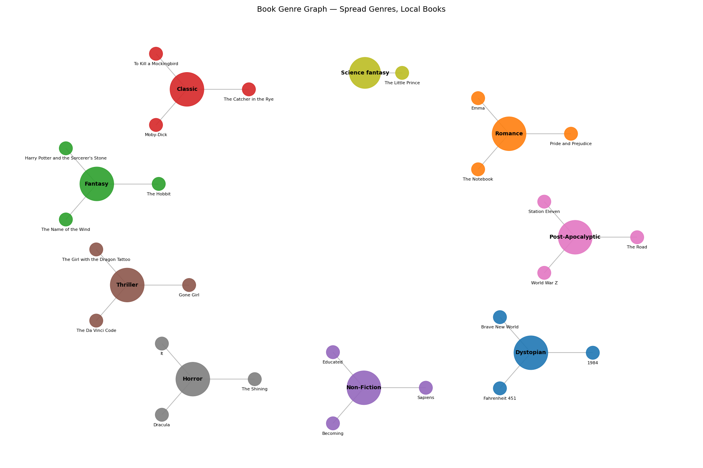

# 📚 Book Database Manager (CLI using pandas and networkx)

A simple interactive **command-line program** to manage a personal book collection using **Python and pandas**. Supports persistent storage in CSV format and operations like **add**, **list**, **remove**, and **search**. Provides option to visualise user's preferences via **genre graph**.

---

## 🛠 Features
- ✅ Load or create books database
- ✅ Add a new book (with title, author, year, genre)
- ✅ List all books
- ✅ Search books by title or author
- ✅ Remove books by title or by index (with confirmation)
- ✅ Generate genre graph based on user's preferences
- 📁 Automatically saves to `[FILE_NAME].csv`

---

## 💾 Requirements

- Python 3.x
- [pandas](https://pandas.pydata.org/)

Install pandas via pip:

```bash
pip install pandas networkx matplotlib numpy
```

---

## 🚀 How to Run

1. Save the program file, e.g. `book_manager.py`
2. Open a terminal and run:

```bash
python book_manager.py
```

---

## 🖥️ Usage Example
You can use mock **books_db.csv** for testing functionality.

```plaintext
📘 Book Database Menu
1. List books
2. Add book
3. Remove book
4. Search books
5. Show genre graph
6. Exit
Choose an option (1-6): 2

Enter book title: 1984
Enter author: George Orwell
Enter publication year: 1949
Enter genre: Dystopian
✅ Book '1984' added.
```

---

## 🕸 Example genre graph


## 📁 Data Format

Books are stored in `[FILE_NAME].csv` with the following columns:

```
Title,Author,Year,Genre
```


